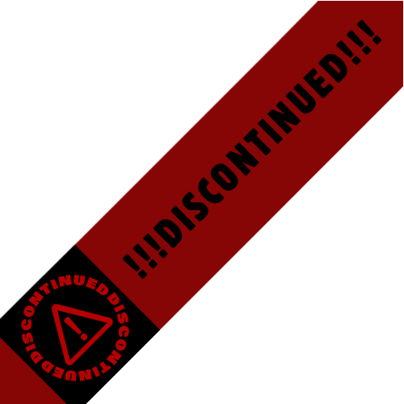

[Main(Home)](https://subfabula.github.io) | [TestGround](https://subfabula.github.io/SF_W/) | [Projects](https://subfabula.github.io/Projects/)

## Welcome

Welcome to my Projects Page!

In this place, I make Projects that I'm involved in, whether with a team or independently. While there may not be many projects at the moment, I hope to add more in the future.

## Projects/Teams
---
### ~~[**QR-Plus**](https://subfabula.github.io/QR-Plus/)~~

    

        
        
    

    

        
<b>REASON OF DISCONTINUATION</b> The QR+ Team in the Teknofest got eliminated on the 4th Stage which resulted in the discontinuation of this WebSite.

        
This <u>was</u> a Website for the QR+ Team, which <u>were</u> a team in Teknofest.

    

 

### [**ARMEE**](https://subfabula.github.io/ARMEE/)

    

        
    

    

        
ARMEE is a team created by 3 highschool students (as of 2024) to join Gameathon.

    

 
<!-- Placeholder for dynamically generated content -->

 Thank you for visiting! 

<!-- GitHub will automatically add your social links below this line -->
